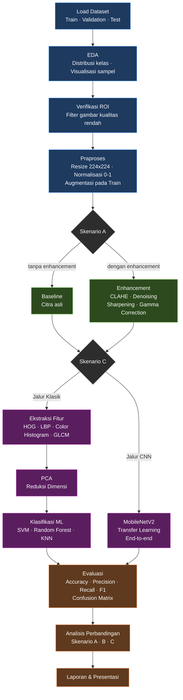

# 📋 Rencana Pengembangan Project
## Klasifikasi Penggunaan Masker pada Wajah (Topik 5)

**Mata Kuliah:** Pengolahan Citra Digital (PCD)  
**Durasi:** 30 Hari (12 Mei 2026 – 10 Juni 2026)  
**Jumlah Anggota:** 5 Orang

---

## 1. Deskripsi Project

Membangun sistem klasifikasi citra wajah untuk mendeteksi kondisi penggunaan masker dengan **3 kelas**:

| Kelas | Deskripsi |
|-------|-----------|
| **With Mask** | Wajah memakai masker dengan benar |
| **Without Mask** | Wajah tidak memakai masker |
| **Mask Worn Incorrectly** | Wajah memakai masker dengan tidak tepat |

> [!IMPORTANT]
> Fokus utama project adalah **pemahaman proses**, bukan hanya akurasi akhir. Setiap keputusan dalam pipeline harus memiliki alasan yang jelas.

---

## 2. Dataset yang Digunakan

**Dataset:** [Face Mask 12K Images Dataset by ashishjangra27](https://www.kaggle.com/datasets/ashishjangra27/face-mask-12k-images-dataset) — Kaggle

| Properti | Detail |
|----------|--------|
| **Total Gambar** | ~12.000 gambar (sudah di-crop area wajah) |
| **Format Gambar** | JPEG |
| **Format Anotasi** | Folder-based (label = nama subfolder) |
| **Split Bawaan** | ✅ Sudah tersedia: `Train/`, `Test/`, `Validation/` |
| **Jumlah Kelas** | 3 kelas |

### Struktur Folder Dataset

```
face-mask-12k-images-dataset/
├── Train/
│   ├── WithMask/         # ~5.000 gambar
│   ├── WithoutMask/      # ~5.000 gambar
│   └── MaskWornIncorrect/
├── Test/
│   ├── WithMask/
│   ├── WithoutMask/
│   └── MaskWornIncorrect/
└── Validation/
    ├── WithMask/
    ├── WithoutMask/
    └── MaskWornIncorrect/
```

> [!NOTE]
> Karena dataset sudah ter-split dan gambar sudah berupa **crop wajah**, tahap face detection/segmentation manual tidak diperlukan. Fokus pipeline beralih ke enhancement, ekstraksi fitur, dan klasifikasi.

---

## 3. Pipeline Teknis



### Detail Setiap Tahap Pipeline

#### 3.1 Akuisisi & Pemahaman Dataset
- Download dataset dari Kaggle (`ashishjangra27/face-mask-12k-images-dataset`)
- Load gambar langsung dari struktur folder `Train/WithMask/`, `Train/WithoutMask/`, dst.
- Eksplorasi distribusi kelas per split (Train, Test, Validation)
- Visualisasi sampel citra per kelas
- Analisis resolusi, ukuran, dan variasi pencahayaan tiap kelas
- Verifikasi integritas data: gambar rusak, duplikat, atau label salah

#### 3.2 Praproses Data
- **Resize** semua citra ke ukuran seragam (misal: 224×224 atau 128×128)
- **Normalisasi** nilai piksel ke rentang [0, 1]
- **Augmentasi** data: rotasi, flip horizontal, brightness adjustment — diterapkan hanya pada data **Train**
- **Split sudah tersedia** dari dataset (Train / Validation / Test) — tidak perlu split manual

#### 3.3 Enhancement / Restoration Citra
- **Histogram Equalization** (CLAHE) untuk memperbaiki kontras
- **Gaussian Blur / Median Filter** untuk denoising
- **Sharpening** menggunakan kernel konvolusi
- **Koreksi pencahayaan** dengan gamma correction
- ⚠️ **Wajib:** Bandingkan hasil **dengan enhancement vs tanpa enhancement**

#### 3.4 Verifikasi & Penyeragaman ROI Wajah
- Gambar dalam dataset **sudah berupa crop wajah** — tahap deteksi wajah dari foto natural tidak diperlukan
- **Verifikasi ROI:** pastikan semua gambar benar-benar menampilkan area wajah (bukan latar belakang atau objek lain)
- **Padding/centering** jika rasio aspek gambar tidak seragam sebelum resize
- Identifikasi dan tandai gambar yang kualitasnya rendah (sangat blur, oklusi ekstrem, dll.)

#### 3.5 Ekstraksi Fitur
Dua pendekatan yang akan dibandingkan:

| Pendekatan | Fitur | Library |
|------------|-------|---------|
| **Fitur Klasik (Manual)** | HOG, LBP, Color Histogram, GLCM | scikit-image, OpenCV |
| **Fitur Otomatis (CNN)** | Feature maps dari convolutional layers | TensorFlow/Keras, PyTorch |

- **HOG (Histogram of Oriented Gradients)** — menangkap bentuk/tepi
- **LBP (Local Binary Pattern)** — menangkap tekstur
- **Color Histogram** — distribusi warna pada ROI
- **GLCM** — statistik tekstur (contrast, energy, correlation, homogeneity)

#### 3.6 Pemodelan Klasifikasi
Dua pendekatan yang akan dibandingkan:

| Metode | Model | Keterangan |
|--------|-------|------------|
| **ML Klasik** | SVM, Random Forest, KNN + PCA | Menggunakan fitur manual; PCA wajib sebelum KNN untuk reduksi dimensi |
| **Deep Learning** | CNN (custom / MobileNetV2) | End-to-end learning; MobileNetV2 cukup untuk 3 kelas |

#### 3.7 Evaluasi Performa
- **Metrik:** Accuracy, Precision, Recall, F1-Score
- **Confusion Matrix** untuk analisis kesalahan per kelas
- **Classification Report** detail per kelas
- **ROC Curve** (opsional)

#### 3.8 Analisis Hasil
- Perbandingan skenario (lihat bagian **Komponen Analisis**)
- Identifikasi kelemahan sistem
- Saran pengembangan lanjutan

---

## 4. Tech Stack

| Komponen | Teknologi |
|----------|-----------|
| Bahasa Pemrograman | Python 3.10+ |
| Image Processing | OpenCV, scikit-image, Pillow |
| Feature Extraction | scikit-image (HOG, LBP, GLCM) |
| Machine Learning | scikit-learn (SVM, RF, KNN) |
| Deep Learning | TensorFlow/Keras atau PyTorch |
| Visualisasi | Matplotlib, Seaborn |
| Notebook | Jupyter Notebook |
| Version Control | Git + GitHub |

---

## 5. Timeline 30 Hari (Detail)

Lihat [TIMELINE.md](TIMELINE.md) untuk rincian jadwal harian, milestone per minggu, dan Gantt chart.

---

## 6. Komponen Analisis Wajib

Berikut analisis yang **harus ada** dalam laporan:

| No | Komponen Analisis | Deskripsi |
|----|-------------------|-----------|
| 1 | Alasan pemilihan topik & dataset | Mengapa memilih Topik 5 dan dataset tertentu |
| 2 | Karakteristik dataset | Distribusi kelas, ukuran, format, tantangan |
| 3 | Masalah citra | Noise, blur, pencahayaan, variasi pose |
| 4 | Enhancement/restoration | Teknik yang digunakan dan alasannya |
| 5 | Fitur yang diekstraksi | HOG, LBP, GLCM, color histogram — alasan pemilihan |
| 6 | Metode klasifikasi | SVM, RF, KNN, CNN — alasan pemilihan |
| 7 | Hasil evaluasi | Accuracy, Precision, Recall, F1-Score, Confusion Matrix |
| 8 | **Perbandingan skenario** | ⬇️ Lihat tabel di bawah |
| 9 | Kelemahan sistem | Identifikasi kekurangan |
| 10 | Saran pengembangan | Ide improvement di masa depan |

### Skenario Perbandingan Wajib

| Skenario | Variabel | Output yang Diharapkan |
|----------|----------|----------------------|
| A | Dengan Enhancement vs Tanpa Enhancement | Tabel akurasi, grafik perbandingan |
| B | Fitur Warna vs Fitur Tekstur | Analisis fitur mana yang lebih diskriminatif |
| C | Machine Learning Klasik vs CNN | Perbandingan performa SVM/RF vs CNN |

---

## 7. Struktur Folder Project

```
TugasAkhir - Klasifikasi masker/
├── data/
│   ├── raw/                    # Dataset asli dari Kaggle (struktur Train/Test/Validation)
│   │   ├── Train/
│   │   │   ├── WithMask/
│   │   │   ├── WithoutMask/
│   │   │   └── MaskWornIncorrect/
│   │   ├── Test/
│   │   │   ├── WithMask/
│   │   │   ├── WithoutMask/
│   │   │   └── MaskWornIncorrect/
│   │   └── Validation/
│   │       ├── WithMask/
│   │       ├── WithoutMask/
│   │       └── MaskWornIncorrect/
│   ├── processed/              # Dataset setelah praproses (resize, normalisasi)
│   └── augmented/              # Dataset Train setelah augmentasi
├── notebooks/
│   ├── 01_eda.ipynb            # Exploratory Data Analysis
│   ├── 02_preprocessing.ipynb  # Praproses & Enhancement
│   ├── 03_feature_extraction.ipynb  # Ekstraksi Fitur
│   ├── 04_ml_classification.ipynb   # ML Klasik
│   ├── 05_cnn_classification.ipynb  # CNN / Deep Learning
│   └── 06_evaluation.ipynb     # Evaluasi & Perbandingan
├── src/
│   ├── preprocessing.py        # Modul praproses
│   ├── augmentation.py         # Modul augmentasi
│   ├── enhancement.py          # Modul enhancement/restoration
│   ├── face_detection.py       # Modul deteksi wajah
│   ├── segmentation.py         # Modul segmentasi/cropping
│   ├── feature_extraction.py   # Modul ekstraksi fitur
│   ├── ml_classifier.py        # Modul klasifikasi ML
│   ├── cnn_classifier.py       # Modul klasifikasi CNN
│   └── utils.py                # Fungsi utilitas umum
├── models/                     # Model yang sudah di-training
├── results/
│   ├── figures/                # Grafik & visualisasi
│   └── metrics/                # Metrik evaluasi (CSV/JSON)
├── docs/
│   ├── laporan.pdf             # Laporan final
│   └── presentasi.pptx         # Slide presentasi
├── requirements.txt            # Dependencies Python
├── README.md                   # Dokumentasi project
├── .gitignore
└── LICENSE
```

---

## 8. Deliverables (Luaran)

| No | Deliverable | Format | Deadline |
|----|-------------|--------|----------|
| 1 | Laporan Project | PDF | 9 Juni 2026 |
| 2 | Kode Program Lengkap | Python (.py + .ipynb) | 9 Juni 2026 |
| 3 | Dataset / Link Sumber Dataset | Folder / URL | 14 Mei 2026 |
| 4 | Slide Presentasi | PPTX / PDF | 9 Juni 2026 |
| 5 | Demo Hasil Program | Notebook / Script | 10 Juni 2026 |

---

## 9. Risiko & Mitigasi

| Risiko | Dampak | Mitigasi |
|--------|--------|----------|
| Kelas tidak seimbang (terutama jika ada kelas kecil) | Akurasi bias ke kelas mayoritas | Cek distribusi saat EDA; terapkan augmentasi dan class weighting jika diperlukan |
| Gambar di dataset ada yang blur/kualitas rendah | Fitur tidak terekstrak dengan baik | Filter gambar buruk saat verifikasi ROI (langkah 3.4) |
| Training CNN terlalu lama | Keterlambatan jadwal | Gunakan transfer learning (MobileNetV2), reduce image size ke 128×128 |
| Overfitting pada model | Performa test buruk | Regularization, dropout, early stopping, augmentasi |
| Pipeline loading data lambat (12K gambar) | Proses training melambat | Gunakan `ImageDataGenerator` dengan `flow_from_directory` atau `tf.data` |
| Anggota kelompok tidak aktif | Beban kerja tidak merata | Daily check-in, pembagian PIC yang jelas |

> [!WARNING]
> **Jangan copy-paste kode dari Kaggle Notebook atau GitHub!** Ini melanggar ketentuan project dan akan berpengaruh pada penilaian. Tulis kode sendiri dengan memahami setiap baris.

---

## 10. Checklist Progress

- [ ] **Minggu 1:** Dataset ready, EDA selesai, pipeline dirancang
- [ ] **Minggu 2:** Praproses, enhancement, dan face detection selesai
- [ ] **Minggu 3:** Model ML & CNN trained, evaluasi awal tersedia
- [ ] **Minggu 4:** Analisis lengkap, laporan, presentasi, dan demo siap

---

> [!IMPORTANT]
> **Reminder:** Orisinalitas kode dan kedalaman analisis adalah komponen penting penilaian. Pastikan setiap keputusan dalam pipeline memiliki **justifikasi yang kuat** dan didokumentasikan dengan baik dalam laporan.
