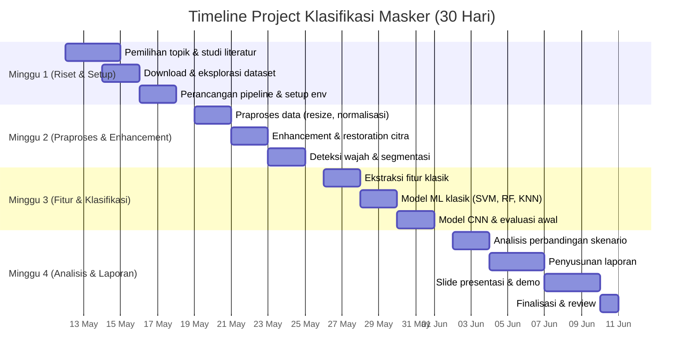

# Timeline Project Klasifikasi Masker (30 Hari)

**Durasi:** 12 Mei 2026 – 10 Juni 2026

---

### 🗓️ Overview Mingguan

---

### 📅 Minggu 1: Riset, Dataset & Setup (12–18 Mei 2026)

> **Tujuan:** Memahami topik, menyiapkan dataset, dan merancang pipeline

| Hari | Tanggal | Kegiatan | PIC (Saran) | Deliverable |
|------|---------|----------|-------------|-------------|
| 1 | Sel, 12 Mei | Diskusi topik, studi literatur tentang face mask detection | Semua | Daftar referensi paper/artikel |
| 2 | Rab, 13 Mei | Review dataset Kaggle, pilih dataset, download | Anggota 1-2 | Dataset terdownload |
| 3 | Kam, 14 Mei | Eksplorasi dataset: distribusi kelas, visualisasi sampel | Anggota 3-4 | Notebook EDA (Exploratory Data Analysis) |
| 4 | Jum, 15 Mei | Analisis karakteristik citra (resolusi, noise, pencahayaan) | Anggota 5 | Laporan karakteristik dataset |
| 5 | Sab, 16 Mei | Setup environment Python, install dependencies | Semua | `requirements.txt`, venv ready |
| 6 | Min, 17 Mei | Perancangan pipeline lengkap, pembagian modul kode | Semua | Dokumen desain pipeline |
| 7 | Sen, 18 Mei | Setup repository GitHub, struktur folder project | Anggota 1 | Repo GitHub ready |

> [!NOTE]
> **Milestone Minggu 1:** Dataset sudah terdownload, EDA selesai, pipeline sudah dirancang, dan environment development sudah ready.

---

### 📅 Minggu 2: Praproses, Enhancement & Verifikasi ROI (19–25 Mei 2026)

> **Tujuan:** Implementasi praproses, enhancement citra, dan verifikasi kualitas ROI wajah

| Hari | Tanggal | Kegiatan | PIC (Saran) | Deliverable |
|------|---------|----------|-------------|-------------|
| 8 | Sel, 19 Mei | Implementasi resize & normalisasi citra | Anggota 1-2 | Modul `preprocessing.py` |
| 9 | Rab, 20 Mei | Implementasi data augmentation (rotasi, flip, brightness) | Anggota 3 | Modul `augmentation.py` |
| 10 | Kam, 21 Mei | Implementasi CLAHE, histogram equalization | Anggota 4-5 | Modul `enhancement.py` |
| 11 | Jum, 22 Mei | Implementasi denoising (Gaussian, Median filter) + sharpening | Anggota 4-5 | Modul `enhancement.py` (lanjutan) |
| 12 | Sab, 23 Mei | Verifikasi ROI: cek semua gambar valid (wajah terdeteksi, tidak blur ekstrem) | Anggota 1-2 | Modul `face_verification.py` |
| 13 | Min, 24 Mei | Padding/centering ROI, handling gambar dengan rasio tidak seragam | Anggota 1-2 | Modul `segmentation.py` |
| 14 | Sen, 25 Mei | Visualisasi hasil enhancement, before/after comparison | Anggota 3 | Notebook perbandingan |

> [!NOTE]
> **Milestone Minggu 2:** Semua modul praproses & enhancement selesai. Verifikasi ROI selesai (gambar tidak valid terfilter). Visualisasi before/after enhancement tersedia.

---

### 📅 Minggu 3: Ekstraksi Fitur & Klasifikasi (26 Mei – 1 Juni 2026)

> **Tujuan:** Ekstraksi fitur, training model ML klasik & CNN, hyperparameter tuning, evaluasi awal

| Hari | Tanggal | Kegiatan | PIC (Saran) | Deliverable |
|------|---------|----------|-------------|-------------|
| 15 | Sel, 26 Mei | Ekstraksi fitur HOG & LBP | Anggota 3-4 | Modul `feature_extraction.py` |
| 16 | Rab, 27 Mei | Ekstraksi fitur Color Histogram & GLCM | Anggota 5 | Modul `feature_extraction.py` (lanjutan) |
| 17 | Kam, 28 Mei | Training model SVM & Random Forest | Anggota 1-2 | Modul `ml_classifier.py` |
| 18 | Jum, 29 Mei | Hyperparameter tuning SVM, RF, KNN (GridSearchCV) | Anggota 1-2 | Hasil tuning, best params |
| 19 | Sab, 30 Mei | Arsitektur CNN (transfer learning MobileNetV2) | Anggota 3-4 | Modul `cnn_classifier.py` |
| 20 | Min, 31 Mei | Training CNN, tuning learning rate & batch size, monitoring loss | Anggota 3-4 | Model trained, learning curves |
| 21 | Sen, 1 Jun | Evaluasi awal semua model: accuracy, confusion matrix | Anggota 5 | Notebook evaluasi awal |

> [!NOTE]
> **Milestone Minggu 3:** Minimal 2 model ML klasik dan 1 model CNN sudah di-training dan di-tune. Evaluasi awal sudah ada (accuracy, confusion matrix).

---

### 📅 Minggu 4: Analisis, Laporan & Presentasi (2–10 Juni 2026)

> **Tujuan:** Analisis mendalam, penulisan laporan, pembuatan presentasi, finalisasi

| Hari | Tanggal | Kegiatan | PIC (Saran) | Deliverable |
|------|---------|----------|-------------|-------------|
| 22 | Sel, 2 Jun | Analisis: dengan enhancement vs tanpa enhancement | Anggota 4-5 | Tabel perbandingan |
| 23 | Rab, 3 Jun | Analisis: fitur klasik vs CNN, ML klasik vs deep learning | Anggota 3-4 | Grafik perbandingan |
| 24 | Kam, 4 Jun | Analisis error: kasus misklasifikasi, pengaruh pose & oklusi | Anggota 1-2 | Analisis kesalahan |
| 25 | Jum, 5 Jun | Mulai penulisan laporan: Bab 1-3 (Pendahuluan, Dataset, Metode) | Anggota 1-3 | Draft laporan |
| 26 | Sab, 6 Jun | Penulisan laporan: Bab 4-5 (Implementasi, Hasil & Analisis) | Anggota 4-5 | Draft laporan (lanjutan) |
| 27 | Min, 7 Jun | Penulisan laporan: Bab 6 (Kesimpulan & Saran) + revisi | Semua | Laporan final draft |
| 28 | Sen, 8 Jun | Pembuatan slide presentasi | Anggota 1-3 | Slide presentasi |
| 29 | Sel, 9 Jun | Persiapan demo program, rehearsal presentasi | Semua | Demo program siap |
| 30 | Rab, 10 Jun | **Finalisasi:** review akhir semua deliverable | Semua | ✅ Semua deliverable selesai |

> [!NOTE]
> **Milestone Minggu 4:** Laporan final, slide presentasi, dan demo program selesai. Semua analisis perbandingan skenario sudah dibahas.
